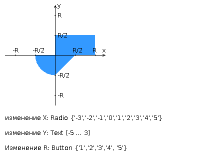

# Лабораторная работа #1

Разработать PHP-скрипт, определяющий попадание точки на координатной плоскости в заданную область, и создать HTML-страницу, которая формирует данные для отправки их на обработку этому скрипту.  
Параметр R и координаты точки должны передаваться скрипту посредством HTTP-запроса. Скрипт должен выполнять валидацию данных и возвращать HTML-страницу с таблицей, содержащей полученные параметры и результат вычислений - факт попадания или непопадания точки в область. Предыдущие результаты должны сохраняться между запросами и отображаться в таблице.  
Кроме того, ответ должен содержать данные о текущем времени и времени работы скрипта.  
<b>Разработанная HTML-страница должна удовлетворять следующим требованиям:</b>
<ul>
<li>Для расположения текстовых и графических элементов необходимо использовать блочную верстку.</li>
<li>Данные формы должны передаваться на обработку посредством POST-запроса.</li>
<li>Таблицы стилей должны располагаться в самом веб-документе</li>
<li>При работе с CSS должно быть продемонстрировано использование селекторов идентификаторов, селекторов элементов, селекторов потомств, селекторов псевдоэлементов а также такие свойства стилей CSS, как наследование и каскадирование.</li>
<li>HTML-страница должна иметь "шапку", содержащую ФИО студента, номер группы и новер варианта. При оформлении шапки необходимо явным образом задать шрифт (cursive), его цвет и размер в каскадной таблице стилей.</li>
<li>Отступы элементов ввода должны задаваться в пикселях.</li>
<li>Страница должна содержать сценарий на языке JavaScript, осуществляющий валидацию значений, вводимых пользователем в поля формы. Любые некорректные значения (например, буквы в координатах точки или отрицательный радиус) должны блокироваться.</li>
</ul>

